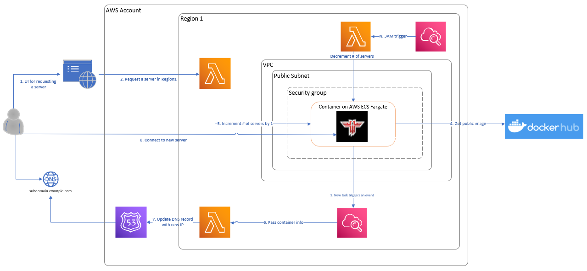
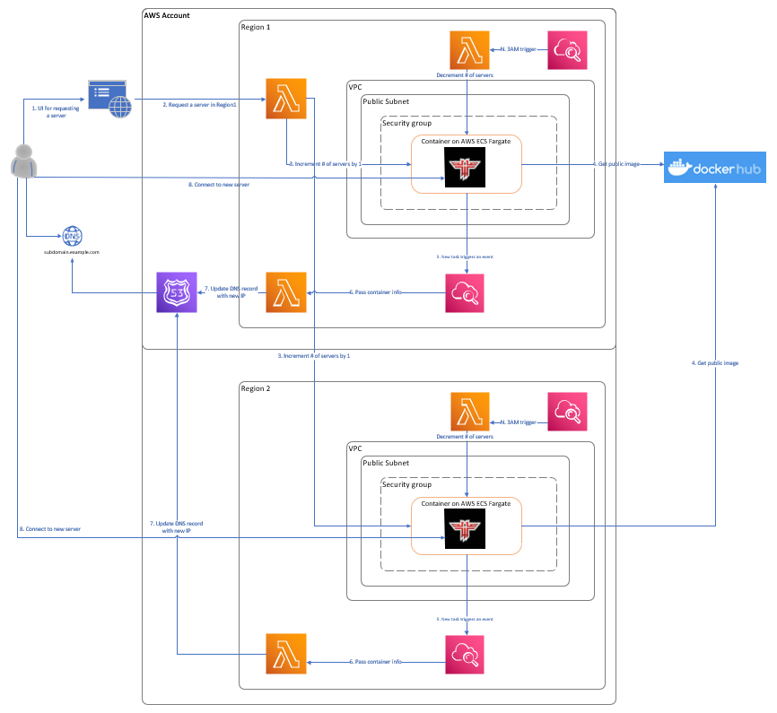

CDK is a framework to create AWS resources with infrastructure as a code (IaaC) approach.
### This CDK project creates a following system:

1. A user/system can issue a call to start a container
2. ECS service is incremented
3. Upon container START event a DNS record is created 
4. At particular time a container is terminated
5. DNS record is deleted.

Simple stack

Cross region collection of stacks

Deploying a solution:
1. Modify mysettings.py and other areas with container task definitions to match your app
2. Establish an IAM user in a region of your choice (main)
3. Bootstrap however many regions for CDK and provide this IAM user
4. cdk deploy --all